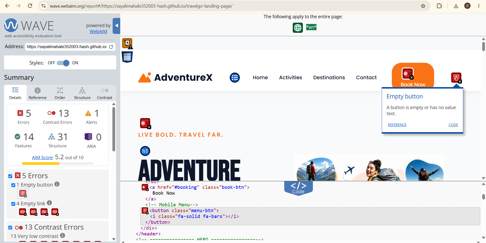
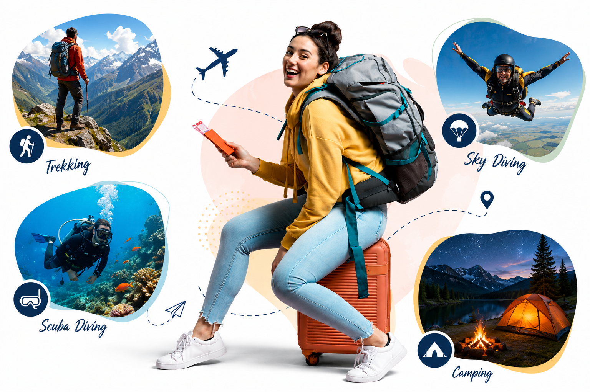

# Accessibility Audit Report

## 1. Website Information

**Website:** AdventureX Landing Page

**Live Website:**  
https://sayalimahale352003-hash.github.io/travelgo-landing-page/

**Accessibility Tool:** WAVE Web Accessibility Evaluation Tool

**Accessibility Standard:** WCAG 2.1 AA

---

## 2. Objective

The objective of this accessibility audit was to identify and fix accessibility issues in the existing AdventureX landing page.

The website was evaluated to improve accessibility for users who use:

- Screen readers
- Keyboard-only navigation
- Visual accessibility features

The website was tested using the WAVE accessibility evaluation tool and manual keyboard navigation.

---

## 3. Before Accessibility Audit

An initial accessibility audit was performed using the WAVE Web Accessibility Evaluation Tool.

### Initial WAVE Results

| WAVE Result | Before |
|---|---:|
| Errors | 5 |
| Contrast Errors | 13 |
| Alerts | 1 |
| Features | 14 |
| Structure | 31 |
| AIM Score | 5.2/10 |

### Before Audit Screenshot



## 4. Issues Identified and Fixes

### 1. Empty Button

The mobile navigation button did not have an accessible name.

**Fix:** Added an accessible label and ARIA state:

```html
<button class="menu-btn"
        aria-label="Open navigation menu"
        aria-expanded="false">
    <i class="fa-solid fa-bars" aria-hidden="true"></i>
</button>
```

This provides an accessible name for the navigation button and helps screen reader users understand its purpose.

---

### 2. Empty Links

The social media links contained icons but did not have accessible names for screen reader users.

**Fix:** Added descriptive `aria-label` attributes and marked the decorative icons as hidden from screen readers:

```html
<div class="social-links">
    <a href="#" aria-label="Facebook">
        <i class="fab fa-facebook-f" aria-hidden="true"></i>
    </a>

    <a href="#" aria-label="Instagram">
        <i class="fab fa-instagram" aria-hidden="true"></i>
    </a>

    <a href="#" aria-label="Twitter">
        <i class="fab fa-twitter" aria-hidden="true"></i>
    </a>

    <a href="#" aria-label="LinkedIn">
        <i class="fab fa-linkedin-in" aria-hidden="true"></i>
    </a>
</div>
```

This gives each social media link a meaningful accessible name.

---

### 3. Color Contrast Errors

The initial WAVE audit identified **13 contrast errors**.

Some text and background color combinations did not provide sufficient contrast according to WCAG 2.1 AA requirements.

WCAG 2.1 AA requires:

- **4.5:1** contrast for normal text
- **3:1** contrast for large text

**Fix:** Changed the website accent color to a darker color:

```css
:root {
    --primary: #0F172A;
    --secondary: #475569;
    --accent: #B45309;
    --light: #F8FAFC;
    --white: #fff;
    --radius: 16px;
    --shadow: 0 20px 40px rgba(0,0,0,.08);
    --transition: .35s ease;
}
```

The Book Now button hover color was also changed:

```css
.book-btn:hover {
    background: #92400E;
}
```

These changes improved the contrast between text and backgrounds.

**Result:** The final WAVE audit reported **0 contrast errors**.

---

### 4. Keyboard Focus Visibility

The original CSS removed the default focus outline from buttons:

```css
button {
    border: none;
    outline: none;
    cursor: pointer;
    font-family: inherit;
}
```

Removing the outline can make it difficult for keyboard users to identify which element currently has focus.

**Fix:** Removed `outline: none`:

```css
button {
    border: none;
    cursor: pointer;
    font-family: inherit;
}
```

A visible focus indicator was added:

```css
a:focus-visible,
button:focus-visible {
    outline: 3px solid #F59E0B;
    outline-offset: 3px;
}
```

This provides a clearly visible focus indicator when navigating through the website using the keyboard.

---

### 5. Alternative Text for Images

Images were checked to ensure that meaningful images have appropriate alternative text.

**Fix:** Meaningful images were provided with descriptive `alt` text.

Example:

```html

```

Another example:

```html

```

Decorative icons were marked so that screen readers do not unnecessarily announce them:

```html
<i class="fa-solid fa-bars" aria-hidden="true"></i>
```

The final WAVE audit confirmed the presence of alternative-text features.

---

### 6. Form Labels

The current landing page does not contain user input form fields requiring `<label>` elements.

Therefore, no form-label issue was identified and no additional form-label changes were required.

**Result:** No form-label changes were necessary for this page.

---

### 7. Keyboard Navigation

The website was manually tested using keyboard navigation without using the mouse.

The following keyboard controls were tested:

| Keyboard Action | Result |
|---|---|
| `Tab` | Passed |
| `Shift + Tab` | Passed |
| `Enter` | Passed |
| `Space` | Passed |
| Visible focus indicator | Passed |

**Result:** Interactive elements were reachable using keyboard navigation, and the focus indicator was visible during keyboard navigation.

---

### 8. WAVE Noscript Alert

The final WAVE audit displayed one alert related to a `<noscript>` element.

The `<noscript>` element is part of the Google Tag Manager implementation.

Example:

```html
<noscript>
    <iframe
        src="https://www.googletagmanager.com/ns.html?id=GTM-NZXJ7FZN"
        height="0"
        width="0"
        style="display:none;visibility:hidden">
    </iframe>
</noscript>
```

**Result:** This alert was reviewed and retained because the element is part of the Google Tag Manager implementation. It is a WAVE alert for manual review, not a WAVE error or contrast error.

---

## 5. Manual Keyboard Testing

Manual keyboard testing was performed after implementing the accessibility fixes.

The website was tested without relying on the mouse.

The following actions were tested:

- Pressed `Tab` to move through interactive elements.
- Pressed `Shift + Tab` to move backward.
- Pressed `Enter` to activate links.
- Pressed `Space` to activate buttons.
- Checked that the keyboard focus indicator was visible.

**Result:** The keyboard accessibility test was completed successfully.

---

## 6. After Accessibility Audit

After implementing the accessibility fixes, the website was scanned again using the WAVE accessibility evaluation tool.

### Final WAVE Results

| WAVE Result | After |
|---|---:|
| Errors | **0** |
| Contrast Errors | **0** |
| Alerts | 1 |
| Features | 14 |
| Structure | 31 |
| ARIA | 11 |
| AIM Score | **10/10** |

### After Audit Screenshot

_Add your final WAVE screenshot here._

---

## 7. Before and After Comparison

| Accessibility Check | Before | After |
|---|---:|---:|
| WAVE Errors | 5 | **0** |
| Contrast Errors | 13 | **0** |
| Empty Button | Found | **Fixed** |
| Empty Links | Found | **Fixed** |
| Color Contrast | Failed | **Fixed** |
| Keyboard Navigation | Required Testing | **Passed** |
| Focus Indicator | Needed Improvement | **Added** |
| Image Alt Text | Reviewed | **Verified** |
| AIM Score | 5.2/10 | **10/10** |

---

## 8. Accessibility Requirements Checklist

| Requirement | Status |
|---|---|
| Before automated accessibility audit | **Completed** |
| All issues documented | **Completed** |
| Color contrast checked and fixed | **Completed** |
| Keyboard-only navigation tested | **Completed** |
| Images checked for meaningful `alt` text | **Completed** |
| Form inputs checked for labels | **Completed** |
| Visible focus indicator added | **Completed** |
| After automated accessibility audit | **Completed** |
| Before/after evidence documented | **Completed** |

---

## 9. Final Result

The final WAVE audit showed:

- **0 Errors**
- **0 Contrast Errors**
- **1 Alert**
- **10/10 AIM Accessibility Score**

The previously identified accessibility errors and contrast issues were resolved.

Manual keyboard testing was also completed successfully.

---

## 10. Conclusion

The AdventureX landing page was audited using the WAVE Web Accessibility Evaluation Tool and manual keyboard testing.

The initial audit identified **5 errors and 13 contrast errors**. The identified issues were addressed by:

- Adding accessible names to buttons and links
- Improving color contrast
- Adding visible keyboard focus indicators
- Verifying image alternative text
- Testing keyboard-only navigation

After implementing the fixes, the final WAVE audit reported **0 errors and 0 contrast errors**, with an **AIM accessibility score of 10/10**.

The website was also tested using keyboard navigation to verify that interactive elements could be reached and operated without relying on a mouse.

### Live Website

https://sayalimahale352003-hash.github.io/travelgo-landing-page/
